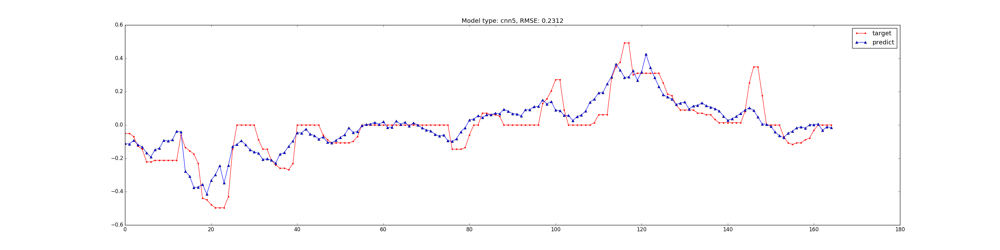
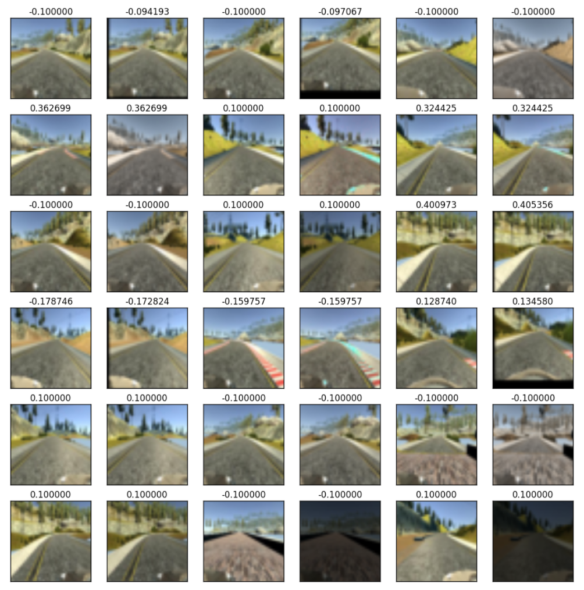
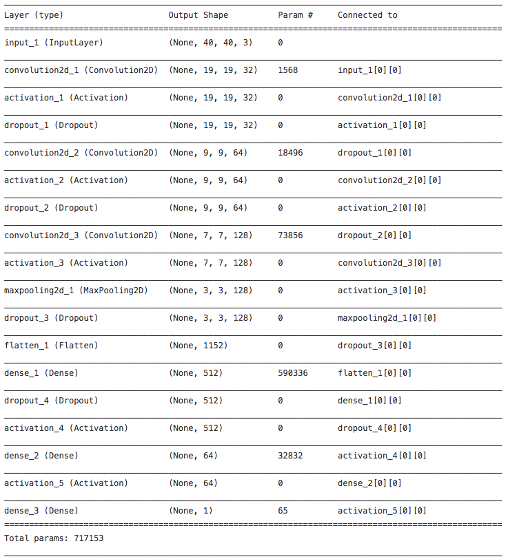

# Predicting Steering Angle using Behavioral-Cloning
Self-Driving Car Udacity project for behavioral cloning exploration and learning to predict a steering angle on the simulated environment.

## Making a video from dataset
In order to better understand the nature of the data you can make a video from a dataset.
```
python video.py --dataset dataset/folder/ --output movie.mp4
```
Video helps if you need to know the frame numbers that you want to cut from data (see [jerky_utils](jerky_utils.py) and `--remove_jerky` params)

Example video (shown as a gif):


## Train a model
Different models can be trained with different parameters.

Example of a command to train a model:
```
python train_model.py --dataset ../../../sdc/behavioral-cloning/data --model cnn5 --validation_split 0.02 --batch_size=20 --remove_jerky --nb_epoch 25 --lr 0.001 --resize_factor 8.0 --left_right --augment 1.0 --small_prob_tr 1.0
```
Example of training cnn5 model (`--model cnn5`), using 2% of all data for validation and test sets (`--validation_split 0.02`), with batch size of 20 (`--batch_size 20`), removing bad part tracks with unappropriate driving (`--remove_jerky` flag), for 25 epochs(`--nb_epoch 25`), with learning rate 0.001 `--lr 0.001`, resizing input image by factor of 8 (`--resize_factor 8.0`), using left and right images (`--left_right`) and turning on augmentation with the 100% chance per each image from training dataset (`--augment 1.0`).

The result of the above command will be stored to: `checkpoints/` directory for weights by epoch, `graphs/` directory for graphs of prediction on hand crafted datasets with two most difficult turns and a corresponding RMSE, plus part prediction from test set.


## Run model on a simulator
By default the model is stored to `model.json` and final trained weights is stored to `model.h5` which can be used later for simulation with `drive.py` as:
```
python drive.py model.json --resize_factor 8.0
```

## Draw predicted steering angles
During the training script evaluates the model on test dataset and drawing predictions of the two most difficult sharp turns on the first map (left turn right after the bridge and the next right turn) which looks like this:


Such graph was proved to be the best indicator of the model performance before actual testing on the simulator.

## Preprocessing
Preprocessing pipeline includes image resizing and normalization. There also a method for cropping bottom part of the image to remove a car but it wasn't used in final training.

Examples of preprocessed and augmented frames size 40x40:



## Augmentation
Augmentation was proved critical for making model work on a given dataset and my ability to generate new data.

One of the four different functions was applied with random params: 1) Noise, 2) Gaussian Filter, 3) Brightness 4) Translation (horizontal/vertical shifts).

Examples of augmented images see above in _Preprocessing_ section.


## Result
The critical part for training a successful model was augmentation technique and learning process that starts from big steering angles dataset (> 0.1) in first epoch and continuously introduce more small angles in subsequent epochs. Without such learning model can't make sharps left and right turns right after the bridge on a first track.

Video:

[](https://www.youtube.com/watch?v=O51z_PW8jQE)

Run simulation using a resulting model and weights:
```
python drive.py result/model_cnn5_rf8s.json --resize_factor 8.0 --restore_weights result/cnn5_rf8s_20161226175434_weights_n119958_01_0.0128_full_better3.hdf5
```

## Dataset
The final result was achieved on a combined dataset of Udacity provided `data` and my personal driving on a simulator using keyboard.

Total number of combined dataset was ~65k frames (including left and right images) and after augmentation the total number of training dataset was ~126k frames.

## Model
Successful model includes two convolutional layers with subsampling (2,2), on convolutional layer with max pooling (2,2), and two fully connected layers with a corresponding sizes of 512 and 654 neurons. Dropout was applied after each convolution layer and after first fully connected.

Model summary stored in a file [result/model_cnn5.txt](result/model_cnn5.txt) just for reference.



## TODO and possible improvements:
A lot of things could be improved here:
- Add a stateful RNN model that can infer knowledge from a time series of subsequent data points.
- Add shadows into augmentation so model can be used on track #2
- Clean code (yep there a lot of way to make it more optimal - cache generated images, remove duplication, etc.)

## Thanks
I firstly underestimate the importance of image augmentation and learning technique that statrs with big angles first, but without such ingredients CNN can't learn on a given dataset even after adding more data.

Thanks to [Vivek Yadav](https://medium.com/@vivek.yadav/using-augmentation-to-mimic-human-driving-496b569760a9#.d2lciuc14) and [Kunfeng Chen](https://medium.com/@KunfengChen/training-and-validation-loss-mystery-in-behavioral-cloning-for-cnn-from-udacity-sdc-project-3-dfe3eda596ba#.qor639o5c) for their great articles about results and hints on a solution.

Also thanks to all guys in Slack channel Self-Driving Car Nanodegree for ideas and support.
